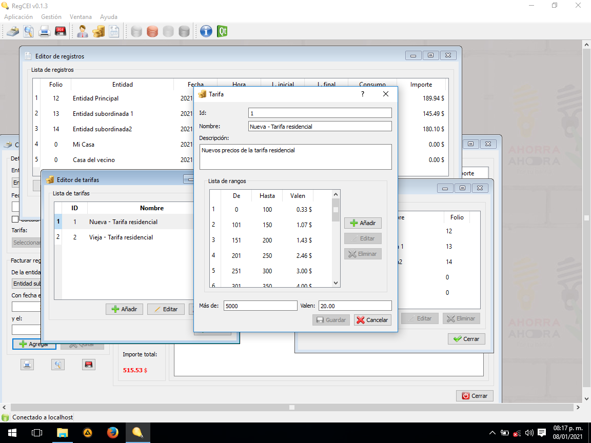
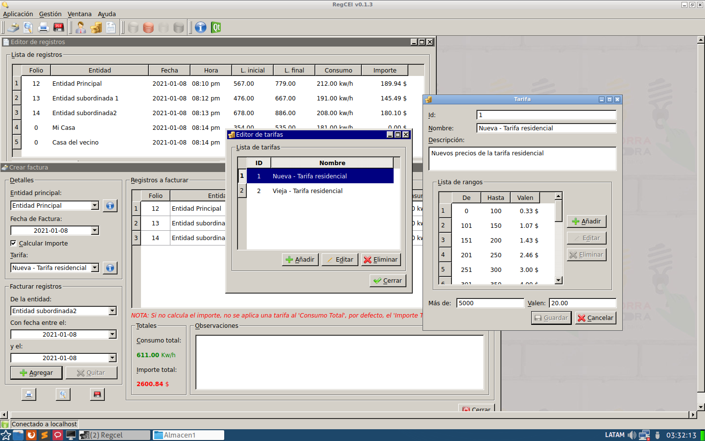

README

- RegCEl v0.1.3  https://barsoft.cubava.cu/

   Copyright 2021 Yunior Barceló Chávez - barceloch@gmail.com
   
   - Descripción

      RegCEl es un registro para el comsumo de energía tanto en los
      hogares como en las empresas.

   - Detalles.

      - Desarrollado en C++ y Qt4 framework.
      - Almacena los datos en SQLite database.
      - Multiplataforma. Trabaja en sistemas operativos como GNU/Linux
       y Microsoft Windows.

   - Instalación.

    - Para instalarlo en windows, descargue el paquete, descomprimalo y ejecute el instalador.
    - Para instalarlo en debian, ubuntu o derivados, descargue el paquete .deb e instalelo con "dpkg -i regcel-0.1.3_i386.deb" desde la terminal   
   
   - Licensia

      Está obra está sujeta a la licencia
      Reconocimiento-CompartirIgual 3.0 Unported de Creative Commons.

      Para ver una copia de esta licencia,
      visite http://creativecommons.org/licenses/by-sa/3.0/.
      
## Screenshots

### En Windows 10

### En Nova GNU/Linux

      

